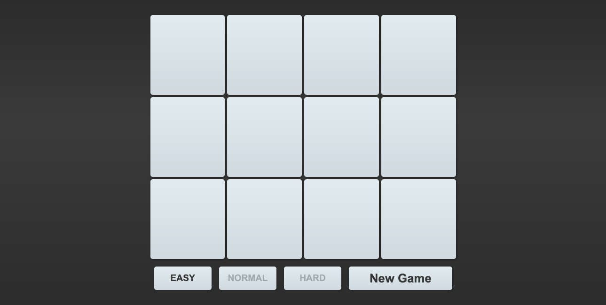

# Memory



Memory game created with React

[VISIT](https://memory-5a764.web.app/)

## Install

```bash
yarn install
```

## Start

```bash
yarn start
```

## Built With

* [React](https://reactjs.org/)
* [Typescript](https://www.typescriptlang.org/)
* [Styled-Components](https://styled-components.com/) (_styles_)
* [Recoil](https://recoiljs.org/) (_state management_)

## License

[MIT](https://choosealicense.com/licenses/mit/)